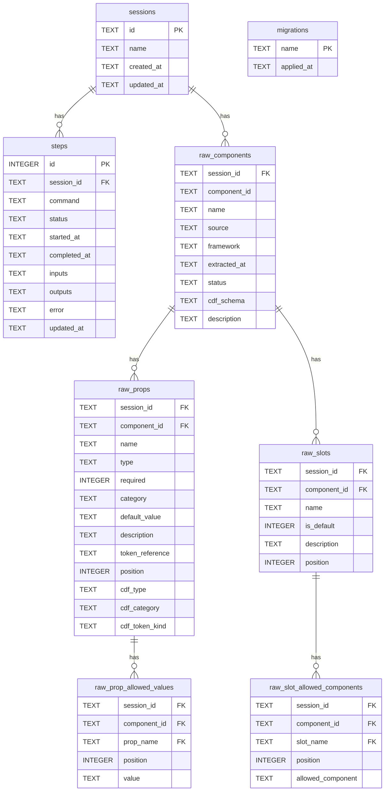
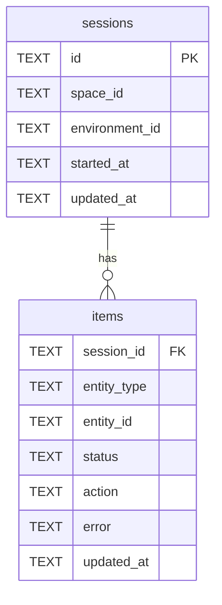
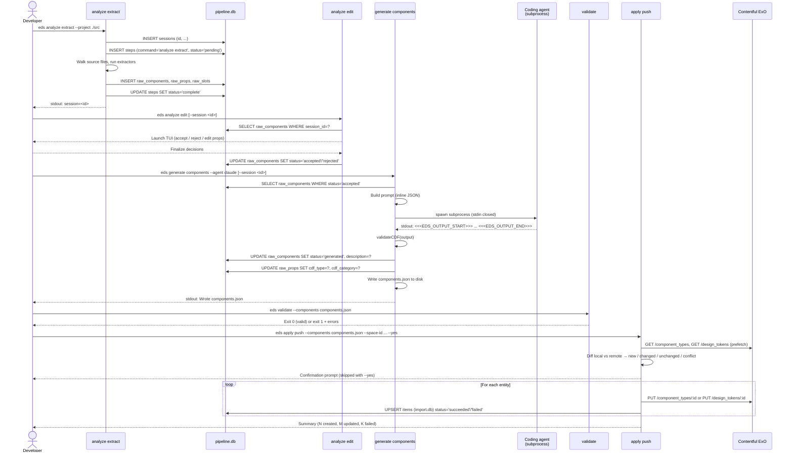
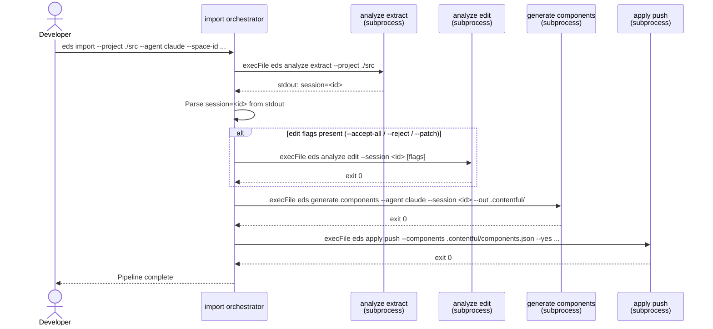

# Architecture

## Overview

The Experience Design System SDK is an Nx monorepo that ships two packages:

| Package | Purpose |
|---|---|
| `@contentful/experience-design-system-cli` | CLI + TUI for extracting, reviewing, generating, validating, and pushing design system component definitions |
| `@contentful/experience-design-system-types` | Shared TypeScript types, Zod schemas, and validation logic for CDF and DTCG formats |

The CLI is the developer-facing ingestion tool in the design system import pipeline. A developer runs it against their component library to produce curated, validated artifacts, then pushes them directly into Contentful Experience Orchestration (ExO) from their terminal.

---

## System Context

```
Design system codebase
  (React / Vue / Astro / Stencil / Web Components)
        │
        ▼
  experience-design-system-cli
    ├── analyze extract   → session DB (raw components)
    ├── analyze edit      → session DB (accepted/rejected decisions)
    ├── generate components → components.json  (CDF artifact via coding agent)
    ├── generate tokens   → tokens.json  (DTCG artifact via coding agent)
    ├── validate          → validates CDF / DTCG files, exits 0/1
    ├── apply preview     → diff output (no writes)
    ├── apply select      → interactive entity picker → PUT /component_types/:id, PUT /design_tokens/:id
    ├── apply push        → PUT /component_types/:id, PUT /design_tokens/:id
    └── import            → orchestrates: analyze extract → analyze edit → generate components → apply push
                              │
                              ▼
                      Contentful ExO
                (component types + design tokens)
```

All intermediary data between pipeline steps flows through a local SQLite session database (`~/.contentful/experience-design-system-cli/pipeline.db`). Only `generate components` and `generate tokens` write output files to disk (`components.json`, `tokens.json`). The `apply` subcommands read those files directly.

---

## Packages

### `experience-design-system-cli`

**Key dependencies:**
- `typescript` — runtime dependency; the CLI compiles customer source files at analysis time. See `docs/adr/2026-04-22-typescript-as-runtime-dependency.md`.
- `ts-morph` — TypeScript compiler API wrapper; all static analysis goes through this
- `ink` — React for the terminal; all TUI components are standard React functional components
- `commander` — CLI argument parsing and help text
- `node:sqlite` (`DatabaseSync`) — built-in Node.js synchronous SQLite for pipeline session state

### `experience-design-system-types`

CDF and DTCG type definitions, JSON schemas, and validation utilities. Published as a separate package and consumed by both the CLI and by customer codebases.

---

## Data Formats

### RawComponentDefinition (extraction output)

Produced by `analyze extract`, stored in the pipeline session database, consumed by `analyze edit` and `generate components`:

```typescript
interface RawComponentDefinition {
  name: string;                           // PascalCase component name
  source: string;                         // absolute path to source file
  framework: 'react' | 'next' | 'vue' | 'astro' | 'web-component' | 'stencil';
  props: RawPropDefinition[];
  slots: RawSlotDefinition[];
}

interface RawPropDefinition {
  name: string;
  type: string;                           // TypeScript type string
  required: boolean;
  category?: 'content' | 'design' | 'state';
  defaultValue?: string;
  allowedValues?: string[];               // for enum / union types
  description?: string;
  tokenReference?: string;                // e.g. "color.brand.primary"
}

interface RawSlotDefinition {
  name: string;
  isDefault: boolean;                     // true = children slot
  description?: string;
  allowedComponents?: string[];
}
```

### CDF (Component Definition Format)

The finalized format for Contentful ExO import. Produced by `generate components`, consumed by `apply preview/select/push`:

```typescript
interface CDFFile {
  $schema: string;
  [key: string]: CDFGroupOrComponent | string | undefined;
}

interface CDFComponentEntry {
  $type: 'component';
  $description?: string;
  $properties: Record<string, CDFPropertyDefinition>;
  $slots?: Record<string, CDFSlotDefinition>;
}

interface CDFPropertyDefinition {
  $type: CDFPropertyType;   // 'string' | 'boolean' | 'number' | 'enum' | 'reference' | 'object' | 'rich-text'
  $category: CDFPropertyCategory;  // 'content' | 'design' | 'state'
  $description?: string;
  $required?: boolean;
  $default?: unknown;
  $values?: string[];
  '$token.kind'?: string;
}
```

### DTCG (W3C Design Token Format)

Design token files following the W3C DTCG spec. Produced by `generate tokens`, consumed by `apply preview/select/push`:

```typescript
interface DTCGTokenLeaf {
  $type: string;
  $value: unknown;
  $description?: string;
}

interface DTCGTokenGroupNode {
  $description?: string;
  [key: string]: DTCGTokenNode | string | undefined;
}
```

---

## Pipeline Session Database

All commands share a single SQLite database at `~/.contentful/experience-design-system-cli/pipeline.db` (overridable via `EDS_PIPELINE_DB_PATH`). A second database, `import.db`, tracks per-entity push results for `apply push` resumption.

`DatabaseSync` (Node.js built-in) is used throughout. Synchronous writes are safe from SIGINT and uncaught exceptions without async ceremony — the database is always consistent at the moment of a signal.

Sessions are created by `analyze extract` and auto-resolved by downstream commands: if `--session` is omitted, each command picks up the most recent completed `analyze extract` session.

### pipeline.db — Entity Relationship Diagram



`raw_components.status` progresses from `'extracted'` (written by `analyze extract`) to `'generated'` (updated by `generate components` after AI processing). The `cdf_*` columns on `raw_props` and the `description` column on `raw_components` are null until `generate components` runs.

### import.db — Entity Relationship Diagram



`import.db` is keyed by `(space_id, environment_id)` — one session per Contentful environment. Each `apply push` upserts item rows as entities are written, enabling resumption after a partial failure.

### Pipeline Data Flow — Sequence Diagram



### Autonomous import — Sequence Diagram

The `import` command orchestrates the full pipeline in a single invocation, shelling out to the individual CLI commands:



---

## React Extractor Architecture

The React extractor (`analyze/extract/react.ts`) is the most complex component (~2500 lines). It uses ts-morph to walk the TypeScript AST of each `.tsx`/`.jsx` file.

### Extraction pipeline per file

```
Source file
  ↓
Find exported PascalCase declarations
  ↓
resolvePropsType()
  → unwraps FC<P>, forwardRef<Ref, P>, PropsWithChildren<P>
  → follows type aliases to their declaration
  ↓
extractPropsFromType()
  ├── isPureExpandableDomAttributeWrapperType?
  │     → getSyntheticDomAttributeProps() (curated list)
  ├── shouldMergeDomSyntaxExtraction?
  │     → syntax path only (intersection with DOM wrapper)
  ├── extractPropsFromInterfaceDeclaration()
  │     ├── hasExpandableDomHeritage?
  │     │     → own-declared members only + curated DOM surface
  │     └── else: symbol extraction
  └── extractPropsFromTypeSymbols()
        → TypeScript symbol enumeration
  ↓
classifyProps() — assigns content / design / state categories
  ↓
detectSlots() — children, render props (renderHeader etc.)
  ↓
RawComponentDefinition
```

### DOM attribute prop surfacing

React components commonly extend `HTMLAttributes<T>`, `ButtonHTMLAttributes<T>`, `SVGProps<T>`, etc. Full TypeScript expansion produces hundreds of props. The extractor uses a curated allowlist (`EXPANDABLE_DOM_ATTRIBUTE_TYPE_NAMES`) to restrict which props are surfaced. See `docs/adr/2026-04-22-dom-attribute-prop-surfacing-strategy.md`.

### Deduplication

`pipeline.ts` runs all extractors in parallel, then deduplicates. When the same logical component is found by multiple extractors (e.g., a Vue component also has a `.tsx` wrapper), it picks the preferred source using path heuristics:
1. Index files (`Button/index.tsx`) preferred over named files
2. Shorter paths preferred
3. Canonical `src/components/X/` structure preferred

---

## The Generate Command

`generate components` and `generate tokens` build a prompt by combining a skill file (markdown instructions) with a runtime preamble:

- **Skill file** — `skills/generate-components-source.md` or `skills/generate-tokens-source.md`; shipped with the package and located at runtime by walking up from the compiled output
- **Runtime preamble** — sets mode (autonomous/interactive), embeds raw component data inline as JSON, lists optional file paths, and instructs the agent on the output protocol

**Output protocol (autonomous mode):** the agent prints its result between `<<<EDS_OUTPUT_START>>>` and `<<<EDS_OUTPUT_END>>>` sentinel markers. `extractSentinelOutput()` handles extraction and detects multiple-block errors.

**Raw components are passed inline, not as a file path.** The session database is read before the prompt is built, and the JSON array is embedded directly in the prompt text. This removes any file system coupling between `analyze extract` and `generate components`.

Do not use agent SDKs or APIs — the generate command invokes agents as subprocesses only. See `docs/adr/`.

---

## The Apply Command

`apply` has three subcommands that share all connection flags and the same diff computation logic:

- `apply preview` — read-only diff; exits 0 if clean, 1 if there are kind conflicts
- `apply select` — interactive checkbox TUI for picking a subset of entities; non-interactive via `--select-all`, `--select`, `--deselect`
- `apply push` — writes all (or selected) entities to Contentful; `--yes` skips confirmation

**Phases:**

1. **Pre-flight** — validate flags, resolve CMA token, check environment exists, parse + validate CDF/DTCG files
2. **Diff computation** — pre-fetch all remote entities → deep-compare mapped local vs remote body → classify as new/changed/unchanged/kindConflict
3. **Confirmation** (`push` only) — interactive summary with "Press Enter to confirm", skipped with `--yes`
4. **Write** (`push` only) — sequential PUT loop: tokens first, then component types; exponential backoff on 429; abort on 401/403; each write is recorded in the session DB
5. **Result** — summary TUI or JSON to stdout

**`cdf-mapper.ts` property routing:**
- `$category === 'content'` or `'state'` → `contentProperties[]`
- `$category === 'design'` → `designProperties[]` (outer keys are viewport IDs, not property names)

**Default viewport:**
```json
{ "id": "all", "query": "*", "displayName": "All Sizes", "previewSize": "100%" }
```

---

## The Import Orchestrator

`import` is a thin orchestrator that shells out to the individual CLI commands in sequence via `child_process.execFile`. It does not re-implement any step logic — it composes the same binaries a developer would run manually.

Steps:
1. `analyze extract --project <path> --out <outDir>` → captures `session=<id>` from stdout
2. Optionally `analyze edit --session <id>` (with `--accept-all`, `--reject`, or `--patch` as applicable)
3. `generate components --agent <name> --session <id> --out <outDir>`
4. `apply push --components <components.json> --space-id ... --environment-id ... --yes`

`--skip-analyze` and `--skip-generate` skip the respective steps. `--no-cache` forces all steps to re-run.

---

## TUI Architecture

All commands have two output modes:

| Mode | Trigger | Implementation |
|---|---|---|
| Non-interactive | `!process.stdout.isTTY` | Plain text to stdout/stderr |
| Interactive TUI | TTY detected | Ink (React) component tree |

| Command | TUI components |
|---|---|
| `analyze extract` | `AnalyzeView` |
| `analyze edit` | Full editor: `App`, `Sidebar`, `ComponentDetail`, `JsonEditor`, `SourcePanel`, dialogs |
| `generate components/tokens` | `GenerateView` |
| `validate` | `ValidateView` |
| `apply preview` | `SummaryView` + `EntityDiffView` |
| `apply select` | `SelectView` (checkbox picker) + `ApplyView` (progress + result) |
| `apply push` | `ApplyView` (confirmation + progress + result), `SummaryView`, `EntityDiffView` |

The TUI uses React hooks for state (`useState`, `useReducer`), Ink's `useInput` for keyboard, and a custom `useUndo` hook for the JSON editor.

Terminal width thresholds:
- 60 columns — minimum for `analyze edit` TUI
- 80 columns — sidebar + detail view
- 120 columns — source panel in `analyze edit`
