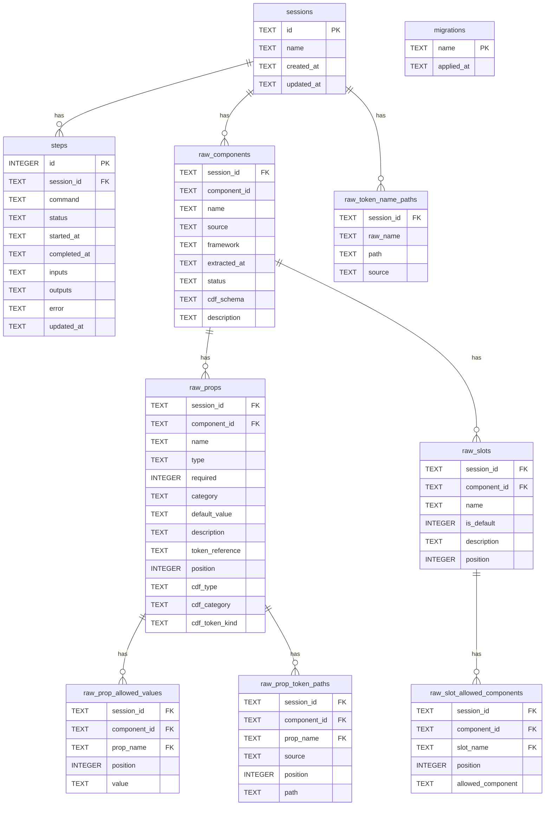
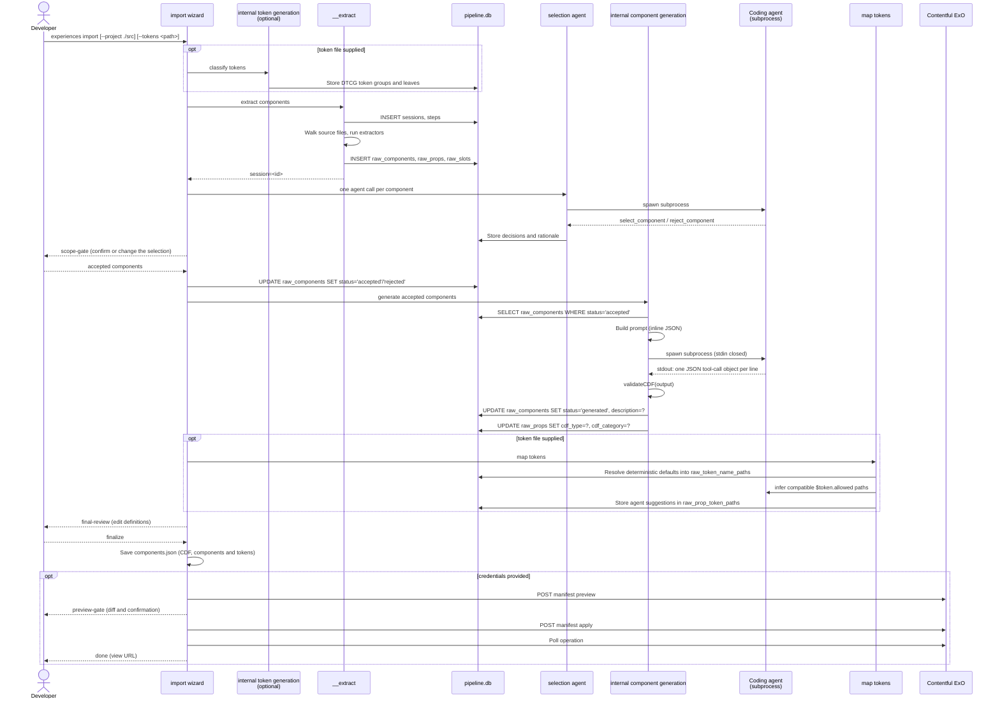
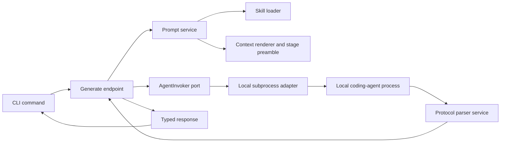

# Architecture

## Overview

The Experience Design System SDK is an Nx monorepo that ships six packages:

| Package                                           | Purpose                                                                                                                                         |
| ------------------------------------------------- | ----------------------------------------------------------------------------------------------------------------------------------------------- |
| `@contentful/experience-design-system-cli`        | CLI + TUI for extracting, reviewing, generating, validating, and pushing design system component definitions                                    |
| `@contentful/experience-design-system-cli-v2`     | Newer Ink TUI, launched with `experiences importv2`; v1 depends on it                                                                           |
| `@contentful/experience-design-system-extraction` | Component extraction engine (ts-morph, per-framework parsers); a runtime dependency of the CLI                                                  |
| `@contentful/experience-design-system-generation` | Agent-invocation and skill-prompt engine used internally by the import wizard                                                                   |
| `@contentful/experience-design-system-client`     | Generated API client for the Experience Design System Integrations API (from `openapi.json`); a runtime dependency of the CLI's `apply` command |
| `@contentful/experience-design-system-types`      | Shared TypeScript types, Zod schemas, and validation logic for CDF and DTCG formats                                                             |

The CLI is the developer-facing ingestion tool in the design system import pipeline. A developer runs it against their component library to produce curated, validated artifacts, then pushes them directly into Contentful Experience Orchestration (ExO) from their terminal.

---

## System Context

```
Design system codebase
  (React / Vue / Astro / Stencil / Web Components)
        │
        ▼
  experience-design-system-cli  (binaries: experiences | exo | experience-design-system-cli)
    ├── import (wizard)         → interactive TUI; drives the full pipeline + scope-gate + final-review + save/push
    ├── apply <file>            → manifest preview, apply operation, and operation polling
    ├── setup                   → interactive prereq + credentials wizard
    ├── doctor                  → prereq health check
    ├── build                   → rebuild a local checkout and re-link the binaries
    ├── importv2                → launches the v2 TUI (experience-design-system-cli-v2)
    └── hidden: __extract, __generate, map tokens, print → subprocesses the wizard spawns
                              │
                              ▼
                      Contentful ExO
                (component types + design tokens)
```

Component-analysis data between pipeline steps flows through a local SQLite session database (`~/.contentful/experience-design-system-cli/pipeline.db`). The wizard runs token mapping after generation when a token file was supplied. `experiences apply <file>` reads one CDF file containing both component and design-token definitions and builds the request for the sources API.

A separate JSON file at `~/.config/experiences/runs.json` records each successful wizard session (id, project path, save path, push target, component count). No command lists these records.

When a token file is supplied (`--tokens` or the token-input step), the wizard performs token generation internally before it extracts and generates components. Token mapping needs the generated CDF and DTCG data in the same pipeline session.

---

## Packages

### `experience-design-system-cli`

**Key dependencies:**

- `typescript` — runtime dependency; the CLI compiles customer source files at analysis time.
- `ts-morph` — TypeScript compiler API wrapper; all static analysis goes through this
- `ink` — React for the terminal; all TUI components are standard React functional components
- `commander` — CLI argument parsing and help text
- `node:sqlite` (`DatabaseSync`) — built-in Node.js synchronous SQLite for pipeline session state
- `@contentful/experience-design-system-extraction` — component extraction engine
- `@contentful/experience-design-system-generation` — agent-invocation and skill-prompt engine used by the import wizard
- `@contentful/experience-design-system-client` — generated API client used by `apply`

### `experience-design-system-cli-v2`

The newer Ink TUI, launched with `experiences importv2` (and its own `experiences-v2` bin). Each menu item (Import, Settings, Upgrade, Help) is an independent flow under `src/tui/`. The Import flow currently spawns `experiences import` from v1 (`src/tui/import/spawn-v1-import.ts`) instead of reimplementing the wizard. v1 depends on v2 (`workspace:*`); v2 must never import v1 code.

**See `packages/experience-design-system-cli-v2/DSI_TUI_ARCHITECTURE.md` for v2-specific architecture and component guidelines.**

**Key dependencies:**

- `ink` 5 and `react` 18 — React renderer for terminals, shared with v1
- `commander` — argument parsing
- `semver` — version checks for the Upgrade flow

### `experience-design-system-extraction`

Component extraction engine: per-framework parsers (React, Vue, Astro, Stencil, Web Components) built on ts-morph, plus prop pre-classification. Consumed by the CLI's internal `__extract` command.

### `experience-design-system-generation`

Typed in-process generation endpoint consumed by the import wizard. The package is organized by responsibility:

- `src/generate/model/` contains transport-neutral request, response, prompt, invocation, protocol, agent, and progress contracts.
- `src/generate/controller/` coordinates one stage attempt: prompt construction, local or future adapter invocation, stage-specific parsing, and failure diagnostics.
- `src/generate/services/` contains skill loading, prompt context rendering, stage preambles, protocol parsing, agent configuration/authentication, failure diagnostics, and progress formatting.
- `src/generate/adapters/local/` contains the local subprocess process and its `AgentInvoker` adapter.
- `src/index.ts` is the only public entry point and re-exports the canonical implementations directly; the package has no other published subpaths.

The generation package does not own HTTP, session storage, caching, batching, retries, parsed-call persistence, or terminal presentation. Those concerns remain in the CLI.

### `experience-design-system-client`

Generated TypeScript client for the Experience Design System Integrations API, generated from `openapi.json` via `@hey-api/openapi-ts`. Consumed by the CLI's `apply` command for `GET`/`PUT` calls against component types and design tokens.

### `experience-design-system-types`

CDF and DTCG type definitions, JSON schemas, and validation utilities. Published as a separate package and consumed by both the CLI and by customer codebases.

---

## Data Formats

### RawComponentDefinition (extraction output)

Produced by extraction, stored in the pipeline session database, consumed by the wizard's scope-gate and internal generation:

```typescript
interface RawComponentDefinition {
  name: string; // PascalCase component name
  source: string; // absolute path to source file
  framework: "react" | "next" | "vue" | "astro" | "web-component" | "stencil";
  props: RawPropDefinition[];
  slots: RawSlotDefinition[];
}

interface RawPropDefinition {
  name: string;
  type: string; // TypeScript type string
  required: boolean;
  category?: "content" | "design" | "state";
  defaultValue?: string;
  allowedValues?: string[]; // for enum / union types
  description?: string;
  tokenReference?: string; // e.g. "color.brand.primary"
}

interface RawSlotDefinition {
  name: string;
  isDefault: boolean; // true = children slot
  description?: string;
  allowedComponents?: string[];
}
```

### CDF (Component Definition Format)

The finalized format for Contentful ExO import. Produced by the import wizard's internal generation step, consumed by `apply`:

```typescript
interface CDFFile {
  $schema: string;
  [key: string]: CDFGroupOrComponent | string | undefined;
}

interface CDFComponentEntry {
  $type: "component";
  $description?: string;
  $properties: Record<string, CDFPropertyDefinition>;
  $slots?: Record<string, CDFSlotDefinition>;
}

interface CDFPropertyDefinition {
  $type: CDFPropertyType; // 'string' | 'richtext' | 'number' | 'media' | 'link' | 'enum' | 'token' | 'boolean'
  $category: CDFPropertyCategory; // 'content' | 'design' | 'state'
  $description?: string;
  $required?: boolean;
  $default?: unknown;
  $values?: string[];
  "$token.kind"?: string;
  "$token.allowed"?: string[]; // restricted DTCG paths; omitted for unrestricted token props
}
```

For design-category token properties, extraction stores the raw default in `raw_props.default_value` and does not rewrite it during mapping. `map tokens` resolves `tokenReference` when present, otherwise the raw default, to a canonical DTCG path when it is exact or has one token-kind-compatible normalized terminal-member match. It persists that source-reference-to-path association in `raw_token_name_paths`. When CDF is projected, that compatible path becomes `$default`; otherwise the raw extracted default is retained. The agentic part of the stage is separate: it may write reviewed-compatible DTCG paths to `$token.allowed`, while an empty or absent restriction leaves the property unrestricted.

### DTCG (W3C Design Token Format)

Design token files following the W3C DTCG spec. Produced by the import wizard's internal generation step, consumed by `apply`:

```typescript
interface DTCGTokenLeaf {
  $type: string;
  $value: unknown;
  $description?: string;
}

interface DTCGTokenGroupNode {
  $description?: string;
  [key: string]: DTCGTokenNode | string | undefined;
}
```

---

## Pipeline Session Database

All commands share a single SQLite database at `~/.contentful/experience-design-system-cli/pipeline.db` (overridable via `EDS_PIPELINE_DB_PATH`). Legacy `import.db` data may be read once by session migration, but the current apply flow uses the sources API manifest operation rather than per-entity push resumption.

`DatabaseSync` (Node.js built-in) is used throughout. Synchronous writes are safe from SIGINT and uncaught exceptions without async ceremony — the database is always consistent at the moment of a signal.

Sessions are created by extraction and passed to the wizard's internal subprocesses as `--session <id>`.

### pipeline.db — Entity Relationship Diagram


```mermaid
erDiagram
    sessions {
        TEXT id PK
        TEXT name
        TEXT created_at
        TEXT updated_at
    }

    steps {
        INTEGER id PK
        TEXT session_id FK
        TEXT command
        TEXT status
        TEXT started_at
        TEXT completed_at
        TEXT inputs
        TEXT outputs
        TEXT error
        TEXT updated_at
    }

    raw_components {
        TEXT session_id FK
        TEXT component_id
        TEXT name
        TEXT source
        TEXT framework
        TEXT extracted_at
        TEXT status
        TEXT cdf_schema
        TEXT description
    }

    raw_props {
        TEXT session_id FK
        TEXT component_id FK
        TEXT name
        TEXT type
        INTEGER required
        TEXT category
        TEXT default_value
        TEXT description
        TEXT token_reference
        INTEGER position
        TEXT cdf_type
        TEXT cdf_category
        TEXT cdf_token_kind
    }

    raw_prop_allowed_values {
        TEXT session_id FK
        TEXT component_id FK
        TEXT prop_name FK
        INTEGER position
        TEXT value
    }

    raw_prop_token_paths {
        TEXT session_id FK
        TEXT component_id FK
        TEXT prop_name FK
        TEXT source
        INTEGER position
        TEXT path
    }

    raw_token_name_paths {
        TEXT session_id FK
        TEXT raw_name
        TEXT path
        TEXT source
    }

    raw_slots {
        TEXT session_id FK
        TEXT component_id FK
        TEXT name
        INTEGER is_default
        TEXT description
        INTEGER position
    }

    raw_slot_allowed_components {
        TEXT session_id FK
        TEXT component_id FK
        TEXT slot_name FK
        INTEGER position
        TEXT allowed_component
    }

    migrations {
        TEXT name PK
        TEXT applied_at
    }

    sessions ||--o{ steps : "has"
    sessions ||--o{ raw_components : "has"
    raw_components ||--o{ raw_props : "has"
    raw_components ||--o{ raw_slots : "has"
    raw_props ||--o{ raw_prop_allowed_values : "has"
    raw_props ||--o{ raw_prop_token_paths : "has"
    sessions ||--o{ raw_token_name_paths : "has"
    raw_slots ||--o{ raw_slot_allowed_components : "has"
```

`raw_components.status` progresses from `'extracted'` (written by extraction) to `'generated'` (updated by the import wizard's internal generation stage after AI processing). The `cdf_*` columns on `raw_props` and the `description` column on `raw_components` are null until internal generation runs.

`raw_prop_token_paths` is the ordered session sidecar for token-property path lists used for `$token.allowed`. Its `source` is `agent` or `review`; review decisions take precedence over later agent suggestions. The separate `raw_token_name_paths` sidecar stores automatic or manual mappings from an extracted source reference to a canonical DTCG path. These sidecars preserve raw extraction while supporting the CDF projection described above.

### Pipeline Data Flow — Sequence Diagram


```mermaid
sequenceDiagram
    actor Dev as Developer
    participant W as import wizard
    participant GT as internal token generation<br/>(optional)
    participant AE as __extract
    participant DB as pipeline.db
    participant Sel as selection agent
    participant GC as internal component generation
    participant Agent as Coding agent<br/>(subprocess)
    participant MT as map tokens
    participant CMS as Contentful ExO

    Dev->>W: experiences import [--project ./src] [--tokens <path>]
    opt token file supplied
        W->>GT: classify tokens
        GT->>DB: Store DTCG token groups and leaves
    end

    W->>AE: extract components
    AE->>DB: INSERT sessions, steps
    AE->>AE: Walk source files, run extractors
    AE->>DB: INSERT raw_components, raw_props, raw_slots
    AE-->>W: session=<id>

    W->>Sel: one agent call per component
    Sel->>Agent: spawn subprocess
    Agent-->>Sel: select_component / reject_component
    Sel->>DB: Store decisions and rationale

    W-->>Dev: scope-gate (confirm or change the selection)
    Dev-->>W: accepted components
    W->>DB: UPDATE raw_components SET status='accepted'/'rejected'

    W->>GC: generate accepted components
    GC->>DB: SELECT raw_components WHERE status='accepted'
    GC->>GC: Build prompt (inline JSON)
    GC->>Agent: spawn subprocess (stdin closed)
    Agent-->>GC: stdout: one JSON tool-call object per line
    GC->>GC: validateCDF(output)
    GC->>DB: UPDATE raw_components SET status='generated', description=?
    GC->>DB: UPDATE raw_props SET cdf_type=?, cdf_category=?

    opt token file supplied
        W->>MT: map tokens
        MT->>DB: Resolve deterministic defaults into raw_token_name_paths
        MT->>Agent: infer compatible $token.allowed paths
        MT->>DB: Store agent suggestions in raw_prop_token_paths
    end

    W-->>Dev: final-review (edit definitions)
    Dev-->>W: finalize
    W->>W: Save components.json (CDF, components and tokens)

    opt credentials provided
        W->>CMS: POST manifest preview
        W-->>Dev: preview-gate (diff and confirmation)
        W->>CMS: POST manifest apply
        W->>CMS: Poll operation
        W-->>Dev: done (view URL)
    end
```

`experiences apply <file>` is the non-wizard route to the same preview and apply steps: it reads one CDF file, builds the manifest, previews it, submits it and polls the operation.

---

## React Extractor Architecture

The React extractor (`packages/experience-design-system-extraction/src/extract/react.ts`) is the most complex component (~2500 lines). It uses ts-morph to walk the TypeScript AST of each `.tsx`/`.jsx` file.

### Extraction pipeline per file

```
Source file
  ↓
Find exported PascalCase declarations
  ↓
resolvePropsType()
  → unwraps FC<P>, forwardRef<Ref, P>, PropsWithChildren<P>
  → follows type aliases to their declaration
  ↓
extractPropsFromType()
  ├── isPureExpandableDomAttributeWrapperType?
  │     → getSyntheticDomAttributeProps() (curated list)
  ├── shouldMergeDomSyntaxExtraction?
  │     → syntax path only (intersection with DOM wrapper)
  ├── extractPropsFromInterfaceDeclaration()
  │     ├── hasExpandableDomHeritage?
  │     │     → own-declared members only + curated DOM surface
  │     └── else: symbol extraction
  └── extractPropsFromTypeSymbols()
        → TypeScript symbol enumeration
  ↓
classifyProps() — assigns content / design / state categories
  ↓
detectSlots() — children, render props (renderHeader etc.)
  ↓
RawComponentDefinition
```

### DOM attribute prop surfacing

React components commonly extend `HTMLAttributes<T>`, `ButtonHTMLAttributes<T>`, `SVGProps<T>`, etc. Full TypeScript expansion produces hundreds of props. The extractor uses a curated allowlist (`EXPANDABLE_DOM_ATTRIBUTE_TYPE_NAMES`) to restrict which props are surfaced.

### Deduplication

`pipeline.ts` (in the same directory) runs all extractors in parallel, then deduplicates. When the same logical component is found by multiple extractors (e.g., a Vue component also has a `.tsx` wrapper), it picks the preferred source using path heuristics:

1. Index files (`Button/index.tsx`) preferred over named files
2. Shorter paths preferred
3. Canonical `src/components/X/` structure preferred

---

## Internal Generation

The import wizard's component and token generation stages call the generation endpoint. The endpoint is transport-neutral and can be wired to a local subprocess adapter today or another `AgentInvoker` implementation later.


```mermaid
flowchart LR
    CLI[CLI command] --> Endpoint[Generate endpoint]
    Endpoint --> Prompt[Prompt service]
    Prompt --> Skill[Skill loader]
    Prompt --> Context[Context renderer and stage preamble]
    Endpoint --> Invoker[AgentInvoker port]
    Invoker --> Local[Local subprocess adapter]
    Local --> Agent[Local coding-agent process]
    Agent --> Parser[Protocol parser service]
    Parser --> Endpoint
    Endpoint --> Result[Typed response]
    Result --> CLI
```

The prompt service combines a skill file (markdown instructions) with a runtime preamble:

- **Skill file** — `skills/generate-components.md`, `skills/generate-tokens.md`, `skills/select-components.md` or `skills/map-tokens.md` in the generation package; shipped with the package and located at runtime by walking up from the compiled output
- **Runtime preamble** — sets mode (autonomous/interactive), embeds raw component data inline as JSON, lists optional file paths, and instructs the agent on the output protocol

**Output protocol:** the agent emits one JSON tool-call object per line to stdout (no sentinel markers). The protocol parser service handles stage-specific validation and returns parsed calls plus warnings. `extractSentinelOutput()` remains a compatibility export for older consumers, but it is not used by the live generation pipeline.

**Raw components are passed inline, not as a file path.** The session database is read before the prompt is built, and the JSON array is embedded directly in the prompt text. This removes any file system coupling between extraction and internal generation.

Do not use agent SDKs or APIs — the import wizard invokes agents as subprocesses only. This is a firm constraint.

### Endpoint ownership

The stage is the request prompt's `skill` (`components`, `tokens`, `select`, or `map-tokens`), so a request cannot name a stage that disagrees with its prompt, and the response's `calls` are typed for that stage. `execute()` builds one prompt, performs one invocation, parses the stage's protocol, and returns raw run metadata, typed calls, warnings, and an optional curated `failure`; callers consume `calls`, `warnings`, and `failure` rather than re-parsing `run.stdout`. `preview()` builds the prompt without invoking an agent. An unsupported stage is rejected with `GenerateRequestError` before any prompt is built. A run with zero calls is a failure for every stage except `map-tokens`, where no suggestions is a valid result.

Retries, concurrency, cache policy, SQLite writes, and application of parsed calls remain outside the endpoint so they stay explicit in the CLI workflow.

---

## The Apply Command

`apply` is the only command that uses the sources API manifest contract. It builds a complete manifest, previews it, optionally confirms, submits the apply operation, and polls it to completion.

`src/apply/command.ts` owns input resolution, slot-cycle checks, selection, and the preview/apply orchestration. It calls `buildManifest` and `buildFilteredManifest` from `experience-design-system-types` to construct `componentsManifest` from CDF component entries and `tokensManifest` from DTCG token entries. `src/apply/api-client.ts` uses the generated client for token validation, manifest preview, manifest apply, and operation polling; `preview-utils.ts` and `tui/` provide response helpers and views.

---

## The Import Command — Wizard

`experiences import` requires an interactive terminal and has no headless mode. Its options are `--project`, `--tokens`, `--agent`, `--prompt <stage=value>` and `--no-cache`; `--model`, `--composition-map`, `--skip-map-tokens` and `--raw-tokens` were removed.

`src/import/tui/WizardApp.tsx` renders a full-screen Ink TUI driven by an explicit step machine:

```
welcome → token-input → path-validation → credentials → extracting (selection agent runs here)
        → scope-gate → generating → final-review → path-prompt
        → previewing → preview-gate → pushing → done
```

`--project` starts at `token-input`; `--tokens` starts at `path-validation` (with `--project`) or `credentials` (without it). Choosing skip on `credentials` saves files only: the preview is bypassed and push is refused.

A single human review gate (`scope-gate`) precedes generation. The final-review step edits names, `$description`, `$default`, `$allowedComponents` and `$values` inline with rationale and source panels, and re-runs the live preview after each save. After final-review the wizard always saves one combined `components.json` CDF, then previews and pushes it unless credentials were skipped.

`--no-cache` bypasses the extract, selection and generation caches and is forwarded to the internal stages.

### Run records

After every successful wizard session, the CLI appends a record to `~/.config/experiences/runs.json`.

### Agent and model

`--agent <name>` accepts `claude`, `codex`, `opencode`, `cursor` or `copilot`, optionally with a model (`--agent claude:sonnet`). Resolution order is flag → `credentials.json` → built-in default; `EDS_AGENT_MODEL_<AGENT>` sets a per-agent model.

### Selection rationale

The selection agent's accept and reject rationale is stored in `raw_components.reject_reason` in `pipeline.db` and shown in the scope-gate and final-review panels.

---

## TUI Architecture

The wizard and `apply` render Ink (React) component trees in a TTY. `experiences import` has no non-interactive mode.

| Command           | TUI components                                                                                                                                                                                                                                                                                   |
| ----------------- | ------------------------------------------------------------------------------------------------------------------------------------------------------------------------------------------------------------------------------------------------------------------------------------------------ |
| `apply`           | `ServerPreviewView`, `ServerApplyView`                                                                                                                                                                                                                                                           |
| `import` (wizard) | `WizardApp` + step components in `src/import/tui/steps/` (`WelcomeStep`, `TokenInputStep`, `PathValidationStep`, `CredentialsStep`, `ScopeGateStep`, `GenerateReviewStep`, `WizardPreviewStep`, `PreviewValidationErrorStep`, `PushingStep`, `DoneStep`, `ErrorStep`, `GateStep`, `RunningStep`) |

The TUI uses React hooks for state (`useState`, `useReducer`), Ink's `useInput` for keyboard, and a custom `useUndo` hook for the JSON editor.

The scope-gate step shows two columns at 100 or more terminal columns and one column below that. `NO_COLOR=1` suppresses ANSI color.

---

## V2 TUI Resources

Design patterns and detailed guidelines for building v2 TUI screens are documented in:

- **`packages/experience-design-system-cli-v2/DSI_TUI_ARCHITECTURE.md`** — v2 architecture and screen guidelines
- **`packages/experience-design-system-cli-v2/.claude/skills/ink-api/SKILL.md`** — Ink core API (Box, Text, colors, hooks)
- **`packages/experience-design-system-cli-v2/.claude/skills/ink-ui/SKILL.md`** — Ink UI component reference
